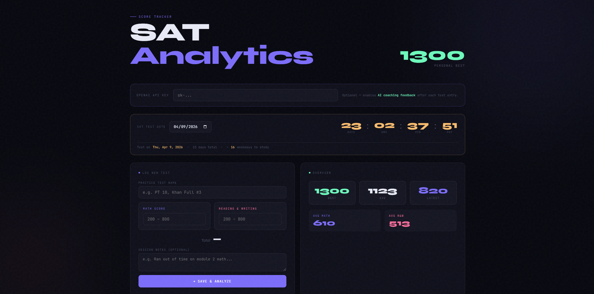
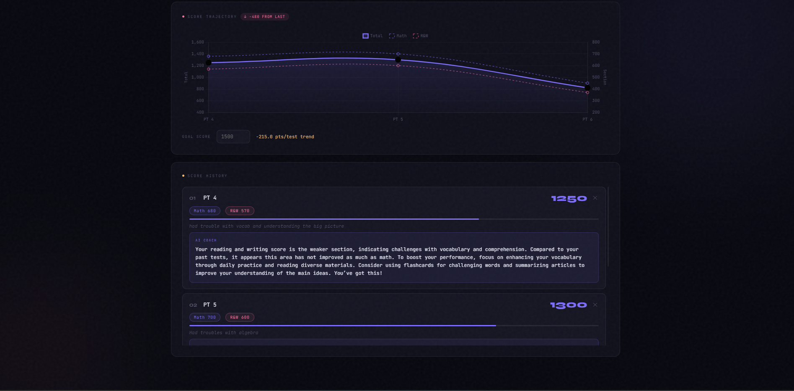

# SAT Analytics

A full-stack web app to track SAT practice test scores, visualize progress, and receive AI-powered coaching feedback after every test.



## Features

- **Section score tracking** — log Math and Reading & Writing scores separately, total calculated automatically
- **Live score trajectory chart** — visualizes all three lines (total, math, R&W) with trend detection
- **AI coaching feedback** — GPT-4o-mini analyzes your history and notes to give personalized study advice after each entry
- **Score prediction** — linear regression across logged tests estimates improvement rate and how many tests until you hit your goal
- **Test date countdown** — live ticking countdown to your SAT date with weekday study day estimate
- **Persistent storage** — scores saved locally to JSON, survive app restarts



## Tech Stack

- **Backend:** Python, Flask
- **Frontend:** HTML, CSS, JavaScript, Chart.js
- **AI:** OpenAI API (GPT-4o-mini)

## Setup

1. Clone the repository
   ```bash
   git clone https://github.com/YOUR_USERNAME/sat-tracker.git
   cd sat-tracker
   ```

2. Install dependencies
   ```bash
   pip install -r requirements.txt
   ```

3. Run the app
   ```bash
   python app.py
   ```

4. Open `http://localhost:5000` in your browser

## AI Coaching

Paste your OpenAI API key into the field at the top of the app. The key is never stored — it's only used per request and stays in your browser session.

## Local Network Access

To use the app on other devices on the same WiFi, change the last line of `app.py` to:

```python
app.run(debug=True, host='0.0.0.0', port=5000)
```

Then open `http://YOUR_PC_IP:5000` on any device on the same network.